**System Design: Agentic PPA Insurance Quoting Workflow (v2.0 - Final)**

**Version:** 2.0
**Date:** 2025-04-18

**1. Introduction**

*   **Goal:** To implement a dynamic, agentic LangGraph workflow for processing Personal Private Auto (PPA) insurance quote requests, replacing the previous hard-coded approach. This design strictly follows the user-provided final workflow diagram.
*   **Scope:**
    *   Manage multi-turn PPA quote conversations initiated via email (or other input channels handled by the External System).
    *   Leverage a central "Planner" agent node to dynamically select and orchestrate "Tools" (derived from Mercury API steps and interaction logic).
    *   Utilize a defined set of Tools, reusing logic and prompts from the proven hard-coded workflow where applicable.
    *   Incorporate two specific Human-in-the-Loop (HITL) interrupt points managed via LangGraph:
        1.  `Agency Review`: An optional pause *before* tool execution for human approval/rejection/editing of the planned action. Rejection forces replanning.
        2.  `Wait for Customer Reply`: A mandatory pause point triggered by the Planner *after* deciding to ask the customer for information, awaiting the customer's response via the External System.
    *   Employ LangGraph best practices: Pydantic for state definition and validation, `MessagesState` conventions for interaction history, and `SqliteSaver` for robust state persistence across turns and interruptions.
*   **Core Philosophy:** The system operates as a planner-centric agent. The `PLANNER_NODE` is the core decision-maker, analyzing the state, conversation history, tool outputs, and human feedback to determine the next step – invoking a tool, entering an HITL state, or completing the workflow. Tools are purely execution units.

**2. High-Level Architecture & Workflow Diagram**

*(Using the user-provided diagram exactly)*

```mermaid
graph LR
    subgraph "External System (Email)"
        NEW_EMAIL[📩 New Email <BR> without thread]
        CUSTOMER_REPLY[📨 EMAIL Reply <BR> Receive Customer reply] --> THREAD_RESOLVER[🧵 Identify LangGraph Thread]
        AGENCY_REPLY[📨 EMAIL Reply <BR> Agency say Accept or Reject] --> THREAD_RESOLVER

        THREAD_RESOLVER -- Loads State from MemorySaver --> RESUME_AGENT[🤖 Resume Agent]
    end

    subgraph "Agent"
        NEW_EMAIL --> AGENT_START[🟢 Start]

        AGENT_START --> PLANNER_NODE[🧠 Planner Node <BR> Decides Tool/Action <BR> Checks human_feedback]

        PLANNER_NODE -- Input--> TOOLS[⚙️ Tools <BR> Intention / Send Email / API Call]
        TOOLS -- Output --> PLANNER_NODE

        RESUME_AGENT --> AGENCY_INTERRUPT
        RESUME_AGENT --> CUSTOMER_INTERRUPT

        PLANNER_NODE -- 👤 HITL --> AGENCY_INTERRUPT["⏸️ Interrupt: <BR> Agency Review"]
        AGENCY_INTERRUPT -- Agency Reply --> PLANNER_NODE

        PLANNER_NODE -- 👤 HITL --> CUSTOMER_INTERRUPT["⏸️ Interrupt: <BR> Wait for Customer Reply"]
        CUSTOMER_INTERRUPT -- Customer Reply --> PLANNER_NODE

        PLANNER_NODE --> WORKFLOW_COMPLETE[🏁 End]
    end

    classDef external fill:#e6f3ff,stroke:#a0cfff
    class CUSTOMER_REPLY,THREAD_RESOLVER,RESUME_AGENT,AGENCY_INTERRUPT,CUSTOMER_INTERRUPT,AGENCY_REPLY,NEW_EMAIL external

```



**Diagram Flow Explanation:**

1.  **External System:** Handles all email interactions.
    *   Receives `NEW_EMAIL` and triggers a new agent run (`AGENT_START`).
    *   Receives `CUSTOMER_REPLY` or `AGENCY_REPLY`, identifies the `thread_id` (via `THREAD_RESOLVER`), loads the corresponding state from the `MemorySaver` (`SqliteSaver`), and resumes the agent (`RESUME_AGENT`) at the appropriate interrupt point (`AGENCY_INTERRUPT` or `CUSTOMER_INTERRUPT`).
2.  **Agent Run:**
    *   Starts at `AGENT_START` or resumes at an interrupt point.
    *   Control always flows to the `PLANNER_NODE`.
    *   The `PLANNER_NODE` analyzes the current state (including new messages from resumption or feedback from agency review). It decides the next action:
        *   Invoke a specific tool: Provides `Input` to the `TOOLS` block.
        *   Request Agency Review: Routes to `AGENCY_INTERRUPT`.
        *   Wait for Customer: Routes to `CUSTOMER_INTERRUPT`.
        *   Complete Workflow: Routes to `WORKFLOW_COMPLETE`.
    *   The `TOOLS` block executes the action dictated by the Planner and provides `Output` (success/failure, data/error) back to the `PLANNER_NODE` for the next planning cycle.
    *   Interrupts (`AGENCY_INTERRUPT`, `CUSTOMER_INTERRUPT`) pause the graph. Resumption, triggered externally via `RESUME_AGENT`, always leads back to the `PLANNER_NODE` to process the new context (feedback or customer reply).

**3. Core Components**

*   **3.1. Agent State (`AgentState`)**
    *   **Definition:** Pydantic `BaseModel` holding the conversation's memory. Persisted via `SqliteSaver`.
    *   **Key Fields:**
        *   `thread_id`: (str) Unique conversation ID.
        *   `goal`: (str) e.g., "Generate accurate PPA quote...".
        *   `messages`: (Annotated[List[BaseMessage], operator.add]) Full conversation history (Human, AI, Tool messages).
        *   `customer_info`: (Dict[str, Any]) Accumulating structured data about the customer/quote.
        *   `mercury_session`: (Optional[Dict[str, Any]]) Context from Mercury APIs (Quote ID, session tokens).
        *   `planned_tool_inputs`: (Optional[Dict[str, Any]]) **Crucial:** Stores the `tool_name` and `args` decided by the Planner for the *next* action. This is reviewed during `AGENCY_INTERRUPT`. Cleared after execution or rejection.
        *   `last_tool_outputs`: (Optional[Dict[str, Any]]) Result from the *immediately preceding* tool execution (`status`, data, error message). Used by Planner for subsequent planning.
        *   `agent_scratchpad`: (Optional[str]) Planner's internal reasoning/notes.
        *   `human_feedback`: (Optional[Dict[str, Any]]) Feedback from `AGENCY_INTERRUPT`, e.g., `{"approved": False, "comment": "...", "edited_inputs": {...}}`. Checked and cleared by Planner.
        *   `requires_agency_review`: (bool) Flag set *by the Planner* if its *next planned action* (in `planned_tool_inputs`) requires agency review.
        *   `awaiting_customer_reply`: (bool) Flag set *by the Planner* when it decides to trigger the `CUSTOMER_INTERRUPT` pause.
    *   **Code Example (Pydantic State):**
        ```python
        from pydantic import BaseModel, Field
        from typing import List, Dict, Optional, Any, Annotated
        from langchain_core.messages import BaseMessage
        import operator
        import uuid

        class AgentState(BaseModel):
            # Conversation Context
            thread_id: str = Field(default_factory=lambda: str(uuid.uuid4()))
            goal: str = "Generate accurate PPA quote for the customer"
            messages: Annotated[List[BaseMessage], operator.add] = Field(default_factory=list)

            # Extracted & API Data
            customer_info: Dict[str, Any] = Field(default_factory=dict)
            mercury_session: Optional[Dict[str, Any]] = None

            # Agent Planning & Execution State
            planned_tool_inputs: Optional[Dict[str, Any]] = None # Plan for NEXT action
            last_tool_outputs: Optional[Dict[str, Any]] = None # Result of LAST action
            agent_scratchpad: Optional[str] = None

            # HITL Control Flags & Feedback
            requires_agency_review: bool = False # Set by Planner for next action
            awaiting_customer_reply: bool = False # Set by Planner to trigger wait
            human_feedback: Optional[Dict[str, Any]] = None # From Agency Review

            class Config:
                arbitrary_types_allowed = True
        ```

*   **3.2. `PLANNER_NODE`**
    *   **Role:** The central intelligence. Orchestrates the entire workflow based on the current state.
    *   **Inputs Considered:** The entire `AgentState`, paying special attention to:
        *   `messages` (latest customer input, full history).
        *   `last_tool_outputs` (success/failure/data from the previous step).
        *   `human_feedback` (instructions from agency review).
        *   `customer_info`, `mercury_session` (current data context).
        *   `goal`.
    *   **Core Logic (LLM Prompt Strategy):**
        1.  **Process Feedback:** If `human_feedback` exists, incorporate it prominently in the prompt context. Instruct the LLM to replan based on this feedback.
        2.  **Analyze State:** Review history, current data, goal, and last action result.
        3.  **Determine Next Step:** Decide the most logical action:
            *   Call a specific Mercury API Tool?
            *   Need customer info? Plan to use `ask_customer_tool`.
            *   Handle previous API error? (Retry, ask, escalate).
            *   Goal met? Plan `prepare_final_summary_tool` or signal completion.
            *   Unsure/Escalate? Plan `request_human_review_tool`.
        4.  **Formulate Plan:** If a tool is chosen, generate the precise `tool_name` and arguments (`planned_tool_inputs`).
        5.  **Decide HITL:**
            *   Set `requires_agency_review = True` if the *planned action* needs review (policy or planner discretion).
            *   Set `awaiting_customer_reply = True` if the plan is to use `ask_customer_tool` (this decision leads to the `CUSTOMER_INTERRUPT` path *after* the tool runs and message is approved/generated).
        6.  **Determine Output Route:** Based on the decision (tool chosen, agency review needed, wait for customer needed, complete), signal the next step for graph routing.
    *   **Output:** An update dictionary for `AgentState`. Key outputs:
        *   `planned_tool_inputs`: The plan for the *next* step.
        *   `requires_agency_review`: Controls routing to `AGENCY_INTERRUPT`.
        *   `awaiting_customer_reply`: Controls routing to `CUSTOMER_INTERRUPT`.
        *   `human_feedback`: Must be set to `None` after being processed.
        *   `agent_scratchpad`: Updated reasoning.
        *   Signals for routing (e.g., a dedicated `next_node` field or implicitly by setting flags).

*   **3.3. `TOOLS` (Execution Block)**
    *   **Role:** Represents the execution of the action planned by the `PLANNER_NODE`. In LangGraph, this is typically handled by a `ToolNode` or a custom function that dispatches to the correct tool.
    *   **Input:** Reads `state.planned_tool_inputs` (which contains `tool_name` and `args`).
    *   **Action:** Calls the specified tool function with the provided arguments.
    *   **Output:** Updates `state.last_tool_outputs` with the tool's return dictionary (`{"status": ..., "data": ...}`). Clears `state.planned_tool_inputs`.
    *   **Tool Definitions:** Derived from existing node logic as discussed (isolate action, wrap with `@tool`, detailed docstring/schema). Includes all Mercury API wrappers (`quote_initiate_tool`, etc.), `ask_customer_tool`, `prepare_final_summary_tool`.

*   **3.4. `AGENCY_INTERRUPT`**
    *   **Purpose:** Pause *before* tool execution for human review of the plan.
    *   **Trigger:** `PLANNER_NODE` sets `requires_agency_review = True`, graph routes here.
    *   **Mechanism:** Uses `InterruptForHumanApproval("agency_review")`.
    *   **Pause State:** Graph pauses. `state.planned_tool_inputs` contains the action to be reviewed. State is persisted by `SqliteSaver`.
    *   **Resumption:** Triggered by `External System` receiving `AGENCY_REPLY`.
        *   **Approval:** External system resumes the graph (`RESUME_AGENT`) without changing `planned_tool_inputs` but potentially clearing `human_feedback`. The interrupt completes, and the graph routes to the `TOOLS` node.
        *   **Rejection/Edit:** External system updates `state.human_feedback` with comments/edits and clears `planned_tool_inputs`. Resumes the graph (`RESUME_AGENT`). The interrupt completes, but the flow routes back to the `PLANNER_NODE` to process the feedback.

*   **3.5. `CUSTOMER_INTERRUPT`**
    *   **Purpose:** Pause the workflow to wait for the customer's reply after deciding to ask them a question.
    *   **Trigger:** `PLANNER_NODE` plans to use `ask_customer_tool`. If review (`AGENCY_INTERRUPT`) is required and approved, the `ask_customer_tool` runs via the `TOOLS` node. The `check_execution_result` logic (after `TOOLS`) sees the successful execution of `ask_customer_tool` and routes here. Alternatively, the Planner could directly set `awaiting_customer_reply=True` and route here *after* the tool generation and approval.
    *   **Mechanism:** Uses `InterruptForHumanApproval("wait_customer")`, primarily as a labelled pause point.
    *   **Pause State:** Graph pauses. The message generated by `ask_customer_tool` (likely in `state.last_tool_outputs`) is ready to be sent by the `External System`. State is persisted.
    *   **Resumption:** Triggered by `External System` receiving `CUSTOMER_REPLY`. External system prepares the new `messages` input, loads the state, and resumes the graph (`RESUME_AGENT`). The interrupt completes, routing back to the `PLANNER_NODE`. The Planner sees the new message in `state.messages`.

*   **3.6. `SqliteSaver` (Checkpointer)**
    *   **Role:** Automatically saves/loads `AgentState` to/from a SQLite file based on `thread_id` provided in the LangGraph config during `invoke`. Essential for multi-turn memory and resuming from interrupts.
    *   **Integration:** `app = workflow.compile(checkpointer=memory, interrupt_before=["agency_review", "wait_customer"])` (using interrupt names).

*   **3.7. External System (Email Handler)**
    *   **Role:** Manages communication channel, triggers/resumes agent runs, resolves thread IDs, sends outgoing messages.
    *   **Key Tasks:**
        *   Parse incoming emails to identify if it's new or a reply (and get `thread_id`).
        *   Prepare input dictionary for `app.invoke`.
        *   Call `app.invoke(input, config)`.
        *   Handle paused states: If paused at `CUSTOMER_INTERRUPT`, retrieve the generated message from the state and send it. If paused at `AGENCY_INTERRUPT`, present review interface.
        *   Process agency feedback to update state before resuming.

**4. Detailed Workflow Walkthroughs**

*   **Scenario 1: New Email, Needs Info, Agency Approves, Waits for Customer**
    1.  `NEW_EMAIL` -> `AGENT_START`.
    2.  `PLANNER_NODE`: Analyzes, sees goal, info missing. Plans `ask_customer_tool`. Sets `planned_tool_inputs={"tool_name": "ask_customer_tool", "args": {"missing_fields": [...]}}`. Sets `requires_agency_review=True` (policy).
    3.  Routes to `AGENCY_INTERRUPT`. Graph pauses.
    4.  *External:* Agency reviews `planned_tool_inputs`, approves. External system resumes via `RESUME_AGENT`.
    5.  `AGENCY_INTERRUPT` completes, routes to `TOOLS`.
    6.  `TOOLS`: Executes `ask_customer_tool`. Returns success + `message_content` in `last_tool_outputs`. Clears `planned_tool_inputs`.
    7.  Control returns to `PLANNER_NODE` (or a check node after TOOLS). Logic sees `ask_customer_tool` succeeded. Planner decides to wait. Sets `awaiting_customer_reply=True`.
    8.  Routes to `CUSTOMER_INTERRUPT`. Graph pauses. State saved.
    9.  *External:* Retrieves `message_content` from state, sends email. Waits.

*   **Scenario 2: Agency Rejects Planned API Call**
    1.  ... previous steps ...
    2.  `PLANNER_NODE`: Analyzes state, decides to call `add_vehicle_tool`. Sets `planned_tool_inputs = {"tool_name": "add_vehicle_tool", "args": {...}}`. Sets `requires_agency_review = True`.
    3.  Routes to `AGENCY_INTERRUPT`. Graph pauses.
    4.  *External:* Agency reviews, *rejects*. Provides feedback: `{"approved": False, "comment": "VIN is incorrect"}`. External system updates `state.human_feedback` with this dict, clears `planned_tool_inputs`, resumes via `RESUME_AGENT`.
    5.  `AGENCY_INTERRUPT` completes, routes back to `PLANNER_NODE`.
    6.  `PLANNER_NODE`: Sees `human_feedback`. Re-evaluates. Might decide to use `ask_customer_tool` to ask for the correct VIN. Clears `human_feedback`. Sets new `planned_tool_inputs`. Sets `requires_agency_review=True` again.
    7.  Routes back to `AGENCY_INTERRUPT` to review the *new* plan.

*   **Scenario 3: Customer Replies with Info**
    1.  ... Graph paused at `CUSTOMER_INTERRUPT` ...
    2.  `CUSTOMER_REPLY` received -> `THREAD_RESOLVER` -> `RESUME_AGENT`.
    3.  `CUSTOMER_INTERRUPT` completes, routes to `PLANNER_NODE`.
    4.  `PLANNER_NODE`: Sees new `HumanMessage` in `state.messages`. Analyzes the reply, updates `customer_info`. Checks if all info for next API (e.g., `add_vehicle_tool`) is now present. If yes, plans `add_vehicle_tool`. Sets `planned_tool_inputs`. Sets `requires_agency_review = False` (maybe).
    5.  Routes towards `TOOLS` execution.

**5. Tool Implementation Details**

*   **(Same as v1.1)** Focus on isolating the *action* logic.
*   Reuse prompts from original nodes where appropriate within the tool's execution logic (e.g., the specific prompt used by `generate_info_request` can be used inside `ask_customer_tool`).
*   Ensure robust error handling within each tool function, returning `{"status": "error", "message": ...}`.
*   Provide excellent docstrings and `args_schema` for the Planner LLM.

**6. HITL Implementation Details**

*   Use `interrupt_before` in `app.compile` referencing the conceptual pause points (e.g., "agency_review", "wait_customer").
*   The external system managing the HITL interface is responsible for updating the `AgentState` correctly (especially `human_feedback` and clearing `planned_tool_inputs` on rejection) before resuming the graph execution via `app.invoke(None, config=...)` or a dedicated resume method if available.

**7. State Persistence**

*   `SqliteSaver` configured at compile time handles automatic saving and loading based on the `thread_id` in the `config` passed to `app.invoke`. This ensures seamless multi-turn memory and state recovery after interruptions.

**8. Advantages**

*   **Planner-Centric Control:** Aligns with advanced agentic patterns.
*   **Clear Separation:** Planner decides *what*, Tools do *how*.
*   **Flexible HITL:** Integrates review and waiting loops naturally.
*   **Robust Persistence:** `SqliteSaver` handles state reliably.
*   **Reusability:** Leverages proven logic from existing nodes.

**9. Challenges**

*   **Planner Complexity:** The `PLANNER_NODE` prompt and logic become highly sophisticated and critical. Extensive testing needed.
*   **LLM Reasoning:** Relies heavily on the LLM's ability to follow instructions, use tools correctly, handle errors based on descriptions, and process feedback.
*   **State Management:** Keeping the `AgentState` concise yet complete for the Planner.
*   **Debugging:** Requires meticulous logging and potentially tools like LangSmith to trace planner decisions and tool interactions.
*   **External System Integration:** Requires careful implementation of the external email handler and HITL interface logic for triggering and resuming.

**10. Refactoring Steps**

1.  Define `AgentState` (Pydantic).
2.  Refactor node logic into Tools (`@tool`, docstrings, schemas).
3.  Implement `PLANNER_NODE` function (prompt engineering is key).
4.  Implement `TOOLS` execution node (e.g., `ToolNode`).
5.  Define conditional routing functions (`check_agency_review`, `check_execution_result`).
6.  Build the `StateGraph` following the diagram v1.2 structure.
7.  Compile with `SqliteSaver` and `interrupt_before`.
8.  Develop/Adapt External System for triggering, message sending, and HITL interaction.
9.  Test rigorously across all scenarios.

This v1.2 design provides a comprehensive blueprint for your agentic refactoring, aligning directly with your final diagram and incorporating the discussed best practices and interrupt handling mechanisms.